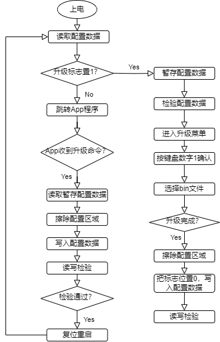
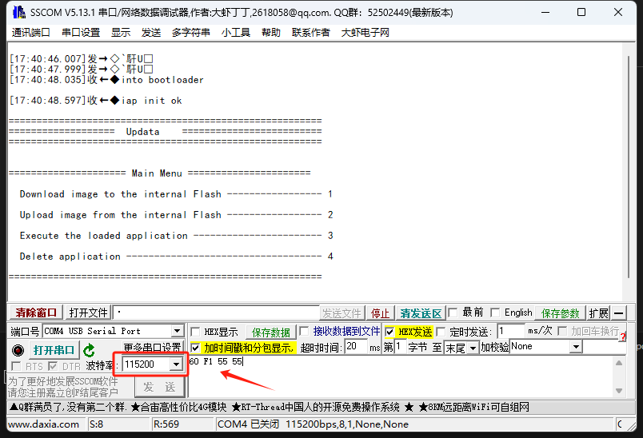
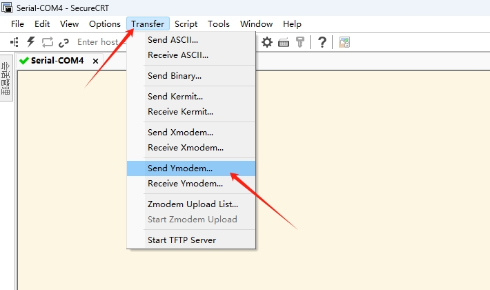
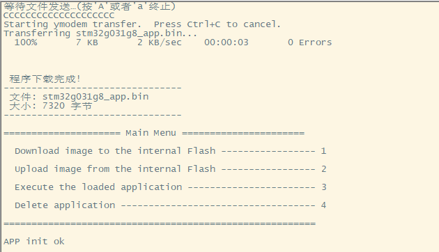

## falsh分区

适用于stm32g031g8_Bootloader，iap升级的代码

stm32g031g8 flah共 64k (0x08000000 - 0x08010000)，分成3个区域：Bootloader、APP、Config

区域    | 起始地址| 大小
-------| -----| -----
Bootloader  | 0x08000000| 16k
APP   | 0x08004000| 46k
Config   | 0x0800F800| 2k

## 程序流程图

## 代码测试

用到两个串口工具进行测试SecureCRT和sscom，iap程序烧录依赖Ymodem协议

首先使用sscom 使用115200波特率，发送16进制数据60 F1 55 55

然后关闭sscom，使用SecureCRT，选择 send Ymodem发送app的bin文件，烧录程序

烧录成功如下图，按下键盘数字3进入APP
